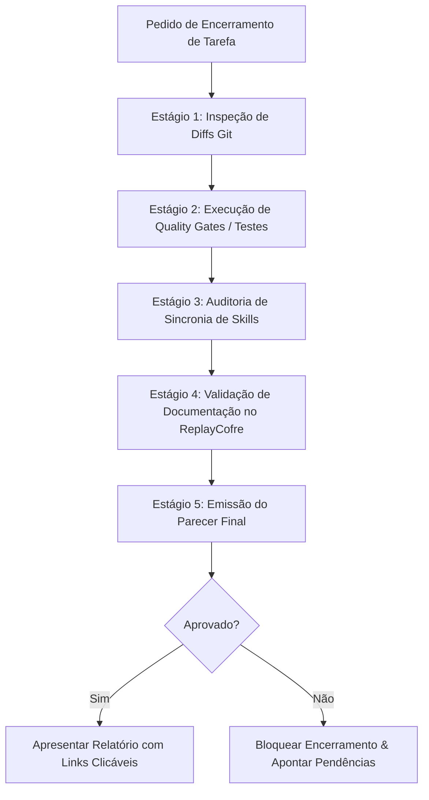

# 🛡️ Skill: Knowledge Audit (Auditoria Independente de Encerramento)

Esta skill atua como o **Quality Gate de encerramento** de qualquer entrega técnica no ecossistema Rock10.

O agente **nunca deve declarar uma tarefa concluída** apenas por afirmação textual.
Esta skill exige verificação empírica, falsificável e auditável em disco antes do encerramento.

---

## 🎯 Por Que Executar Esta Auditoria?
1. **Prevenção de Falsa Conclusão**: Agentes de IA frequentemente afirmam que "atualizaram a documentação" ou que "os testes passaram" sem que nenhum arquivo tenha sido alterado ou comando executado.
2. **Proteção do Grafo do Obsidian**: Prevenir wikilinks quebrados (`[[Nota-Inexistente]]`) ou caminhos absolutos locais vazados.
3. **Garantia de Qualidade de Código**: Garantir que `tsc` e suítes de teste estejam 100% verdes antes do commit.

---

## 🔄 Procedimento de Auditoria de 5 Estágios



---

### Estágio 1: Auditoria de Diffs Reais no Git
Execute comandos de inspeção em todos os repositórios tocados:
```bash
git status -s
git diff --stat
```
- **Critério**: Deve haver alterações reais condizentes com o objetivo da tarefa.
- **Falha**: Se o agente afirma ter corrigido um bug ou criado uma tela, mas `git status` está limpo ou o arquivo não existe, a auditoria é **reprovada imediatamente**.

### Estágio 2: Execução dos Quality Gates do Projeto
Consulte a seção `validation` do `rock10-manifest.json` para o projeto alvo e execute o comando:
- **No `ReplayPanelAPP`**: `npm run build` (`tsc --noEmit && vite build`).
- **No `replayapp`**: `npm run build:check` (`tsc --noEmit && vite build`).
- **No `rock10-ui`**: `npm test` e `npm run build`.
- **Na `ReplayAPI-PHP`**: `php bin/test-bootstrap.php` e `php -l index.php`.
- **No `ReplayClienteGO` / `ReplayLiveModule`**: `go vet ./...` e `go test ./...`.
- **Critério**: O comando deve retornar Exit Code 0 com zero erros de compilação ou teste.

### Estágio 3: Auditoria de Sincronia de Skills
Se estiver no `ReplayCofre` ou se skills compartilhadas foram tocadas:
```bash
node scripts/sync-skills.mjs --check
```
(ou `node ../ReplayCofre/scripts/sync-skills.mjs --check` se posicionado em repositório irmão).
- **Critério**: Retorno com status de sucesso sem drift.

### Estágio 4: Integridade Documental e Wikilinks no ReplayCofre
Verifique os arquivos markdown criados ou alterados no `ReplayCofre`:
1. **Frontmatter Válido**: contém `tipo`, `titulo`, `tags`, `criado`, `atualizado`.
2. **Sem Caminhos Absolutos**: ausência total de `C:\`, `D:\`, `E:\` hardcoded.
3. **Reindexação Concluída**: a nova nota foi adicionada na tabela de índice correspondente (`INDICE-PADROES.md`, `INDICE-DECISOES.md`, etc.).
4. **Catálogo de Código Atualizado**: se foi criado controller ou tela, o respectivo manual em `02-Projetos/` foi atualizado.

### Estágio 5: Emissão do Parecer Final
Apresente o resumo estruturado ao desenvolvedor:

```markdown
🛡️ **Parecer de Auditoria Independente**:
- Status: [✅ APROVADO / ❌ BLOQUEADO]
- Diffs Verificados: [N arquivos modificados em X repositórios]
- Quality Gates: [tsc / testes executados com Exit Code 0]
- Sincronia de Skills: [100% alinhado via sync-skills.mjs]
- Documentação no ReplayCofre: [Notas criadas/atualizadas e reindexadas]
- Links Clicáveis:
  - [NomeDoArquivo.tsx](file://./caminho/Arquivo.tsx)
  - [NotaNoCofre.md](file://../ReplayCofre/03-Padroes/nota.md)
```
