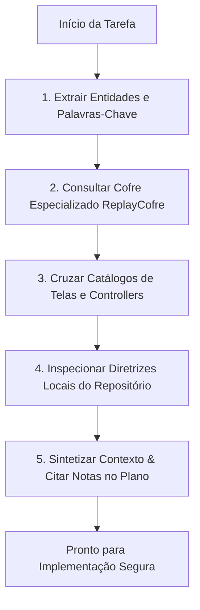

# 🔍 Skill: Knowledge Discovery (Descoberta Prévia de Conhecimento)

Esta skill estabelece o procedimento mandatório de **recuperação de contexto antes de qualquer ação** no ecossistema Rock10.

Nenhum código deve ser proposto ou alterado antes que o agente execute esta varredura.

---

## 🔓 Permissão de Leitura Autônoma (Zero Fricção)

> [!IMPORTANT]
> **O agente tem autorização prévia, total e irrestrita para buscar, listar e ler quaisquer arquivos em todos os repositórios do ecossistema Rock10.**
> 
> - **NÃO pergunte** ao desenvolvedor se pode ler um arquivo, inspecionar um controller, verificar o cofre ou rodar comandos de leitura (`glob`, `grep`, `cat`, `view`).
> - A leitura é uma operação **segura, passiva e obrigatória**. Execute-a imediatamente de forma autônoma e apresente diretamente as conclusões no plano.

---

## 🎯 Por Que Executar Esta Skill Primeiro?
1. **Evitar Alucinações e Reimplementações**: Centenas de padrões, regras e decisões arquiteturais já estão resolvidos e documentados no `ReplayCofre`.
2. **Respeitar as Regras Invioláveis do Ecossistema**: O ecossistema possui regras estritas de isolamento multi-tenant (`id_grupo`), migrations Phinx obrigatórias reversíveis, permissões e rotas reservadas.
3. **Harmonizar o Trabalho com a Fonte de Verdade**: O `ReplayCofre` guarda a autoridade canônica das regras de domínio e catálogos tela-a-tela / rota-a-rota.

---

## 🔄 Fluxo de Execução Passo a Passo



### Passo 1: Extração de Entidades e Palavras-Chave
Extraia da solicitação do usuário os eixos temáticos:
- **Domínio**: ex.: `mensalidades`, `lives`, `stories`, `desafios`, `ranking elo`, `cameras`, `asaas`.
- **Camada**: `api` (PHP), `painel` (React), `app` (PWA mobile), `hardware` (Go), `ui` (design system).
- **Operação**: criação de tela, alteração de banco, integração de gateway, refatoração de estado.

### Passo 2: Varredura no Cofre Especializado Rock10 (`ReplayCofre/` ou `../ReplayCofre/`)
1. Leia o índice geral:
   - Se estiver dentro de `ReplayCofre`: `./01-Indices/INICIO.md` e `./01-Indices/GUIA-DEV-IA-PADROES-E-REGRAS.md`.
   - Se estiver dentro de um repositório irmão: `../ReplayCofre/01-Indices/INICIO.md` e `../ReplayCofre/01-Indices/GUIA-DEV-IA-PADROES-E-REGRAS.md`.
2. Consulte os índices temáticos no cofre:
   - `01-Indices/INDICE-PADROES.md` (padrões de interface, cobrança, streaming).
   - `01-Indices/INDICE-DECISOES.md` (ADRs do Rock10 — não reabrir discussões já arquitetadas).
   - `01-Indices/INDICE-PROBLEMAS.md` (postmortems de bugs e armadilhas já diagnosticadas).
3. Localize o projeto específico em `02-Projetos/` (`replayapi-php.md`, `replaypanelapp.md`, `replayapp.md`, etc.).

### Passo 3: Cruzamento com Catálogos Detalhados
Se a tarefa envolver rotas ou telas, consulte os manuais canônicos do cofre:
- API PHP: `02-Projetos/catalogo-controladores-replayapi-php.md`
- Painel Web: `02-Projetos/catalogo-telas-fluxos-replaypanelapp.md`
- PWA Atleta: `02-Projetos/catalogo-telas-fluxos-replayapp.md`
- E2E Integrado: `02-Projetos/mapa-fluxos-integrados-ecossistema.md`

### Passo 4: Inspeção das Diretrizes Locais do Repositório
No repositório de trabalho atual, leia:
- `AGENTS.md`: regras invioláveis locais, stack homologada e comandos de teste.
- `CLAUDE.md`: diretrizes de execução rápida e estilo de código.

### Passo 5: Síntese Obrigatória no Plano de Execução
Ao apresentar o plano ao desenvolvedor, cite explicitamente quais notas e regras foram recuperadas:
```markdown
📚 **Contexto Recuperado do ReplayCofre**:
- Decisões vigentes: [[decisao-arquitetura-...]]
- Padrões aplicáveis: [[padrao-...]]
- Catálogos consultados: [[catalogo-controladores-...]]
- Regras aplicadas: [Regra 1: Multi-Tenancy, Regra 6: Gating de Módulos]
```

---

## 📋 Checklist de Aceite da Descoberta
- [ ] O agente citou as notas relevantes do `ReplayCofre` no plano inicial.
- [ ] O agente verificou se a funcionalidade já existia em algum controller ou tela antes de propor código novo.
- [ ] Nenhuma premissa foi tomada baseada em suposições sem conferência no catálogo.
