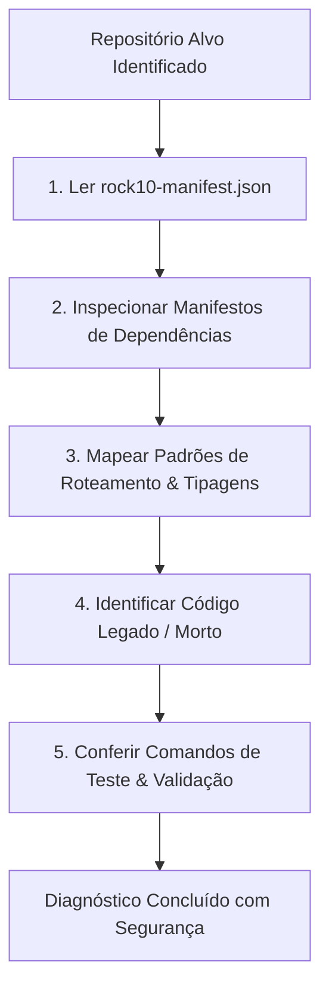

# 🔎 Skill: Repository Investigation (Investigação Cirúrgica do Repositório)

Esta skill orienta a análise prévia do código executável do repositório antes de realizar qualquer alteração,
garantindo que o agente compreenda a realidade física do repositório em vez de assumir estruturas teóricas.

---

## 🔓 Permissão de Investigação Autônoma (Sem Perguntas de Leitura)

> [!IMPORTANT]
> **A inspeção de código e leitura de manifests têm autorização pré-aprovada irrestrita.**
> 
> NUNCA interrompa o fluxo perguntando se pode ler `package.json`, `composer.json`, `routes`, `schemas` ou controllers. Faça a leitura imediatamente e prossiga com o diagnóstico.

---

## 🎯 Por Que Executar Esta Skill?
1. **Evitar Código Morto / Deprecado**: Repositórios antigos acumulam arquivos legados (ex: `src/Servicos` ou `src/App.tsx` no `replayapp`).
2. **Conferir Versões Reais de Bibliotecas**: Tailwind 4 vs Tailwind 3, React 18 vs React 19, Slim 4 vs Slim 3 exigem sintaxes completamente diferentes.
3. **Respeitar os Padrões Existentes**: Seguir a arquitetura de rotas, injeção de dependência e estilização já adotada pelo time.

---

## 🔄 Fluxo de Investigação Passo a Passo

### Passo 1: Leitura do Manifesto Portátil (`rock10-manifest.json`)
Consulte o manifesto localizado no `ReplayCofre` (`./rock10-manifest.json` ou `../ReplayCofre/rock10-manifest.json`):
- Papel primário (`primaryRole`).
- Stack tecnológico homologado.
- Arquivos de catálogo e instruções.
- Comandos de validação (`validation`).

### Passo 2: Inspeção de Dependências e Configurações Reais
Leia os arquivos de configuração reais da raiz do repositório alvo:
- **Node / React (`ReplayPanelAPP`, `replayapp`, `rock10-ui`)**:
  - `package.json`: verificar scripts e versões de `@rock10/ui`, `react`, `vite`, `tailwindcss`.
  - `tsconfig.json`: mapear aliases de import (ex: `@/*` $\to$ `src/*`).
  - `vite.config.ts`: verificar proxies de `/api` e plugins ativos.
- **PHP (`ReplayAPI-PHP`)**:
  - `composer.json`: verificar versão do PHP (8.3), Slim Framework, Phinx e bibliotecas HTTP/JWT.
  - `phinx.php`: verificar credenciais de banco e caminho de migrations (`db/migrations`).
- **Go (`ReplayClienteGO`, `ReplayLiveModule`)**:
  - `go.mod`: verificar versão do Go (1.24 ou 1.27) e módulos de WebSocket/AWS SDK.
  - `Makefile`: verificar targets de build e testes concorrentes (`make race`).

### Passo 3: Mapeamento de Roteamento e Estrutura Real
Identifique o ponto de entrada e o roteamento:
- **`ReplayPanelAPP`**: `src/Routes/RootRouter.tsx` e `src/Routes/reservedSlugs.ts`.
- **`replayapp`**: `src/main.tsx` e `src/Routes/AppRoutes.tsx`.
- **`ReplayAPI-PHP`**: `index.php` e `src/controllers/`.
- Verifique se a nova funcionalidade é uma rota pública, protegida por JWT de grupo ou de master admin.

### Passo 4: Mapeamento de Tipagens e Contratos
- Verifique se os tipos TypeScript dos modelos já existem em `@rock10/ui` ou `src/types/`.
- Nunca declare `any` cego quando já existirem interfaces completas documentadas no cofre ou no código.

### Passo 5: Verificação dos Comandos de Validação
- Confirme os comandos declarados no `AGENTS.md` local (`npm run build:check`, `npm test`, `php -l`, `go vet`).
- Garanta que você sabe exatamente como verificar a sanidade do projeto antes de propor commits.
