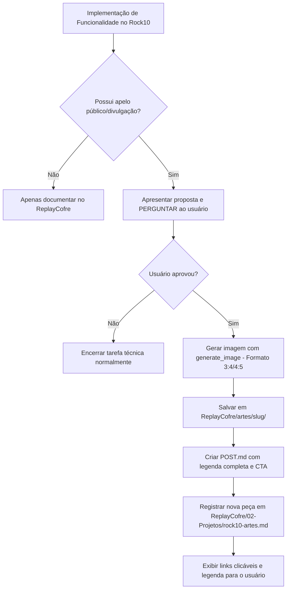

# 📸 Skill: Rock10 Social Marketing (Divulgação no Instagram)

Esta skill define as diretrizes, padrões visuais, estrutura de copywriting e fluxo de trabalho para criar materiais de divulgação no Instagram (Feed 4:5 e Stories 9:16) quando novas funcionalidades de impacto forem desenvolvidas no ecossistema **Rock10** (`ReplayAPI-PHP`, `ReplayPanelAPP`, `replayapp`, `ReplayClienteGO`, `ReplayLiveModule`, `rock10-ui`).

---

## 🚨 REGRA INVIOLÁVEL: PERGUNTAR ANTES DE CRIAR

> [!IMPORTANT]
> **O agente NUNCA deve gerar a imagem ou a legenda de forma automática sem a autorização expressa do usuário.**
> 
> Após concluir a implementação de uma funcionalidade que possua apelo público, o agente deve **obrigatoriamente apresentar a proposta e aguardar a confirmação do usuário** antes de disparar ferramentas de geração de imagem.

### Modelo da Pergunta de Confirmação:
Ao finalizar a tarefa técnica, apresente a pergunta de forma direta:

```markdown
💡 **Divulgação no Instagram (Rock10)**:
Identifiquei que a nova funcionalidade **[Nome da Funcionalidade / Melhoria]** tem forte apelo para comunicação com [donos de arenas / atletas / gerentes].

- **Conceito Visual Proposto**: Arte vertical 4:5 com estética noturna esportiva, destaque para "[Título Curto da Arte]" e elementos gráficos de [telemetria / replay / conectividade].
- **Foco da Legenda**: Destacar o ganho prático de [agilidade / transparência / faturamento / engajamento].

Deseja que eu gere a arte para o Instagram e a legenda completa para postagem?
```

---

## 🎯 Critérios de Avaliação: O que Vale a Pena Divulgar?

Nem toda mudança no código precisa de uma publicação comercial. Avalie se a alteração se enquadra em um dos pilares:

| Pilar | Exemplos Práticos no Rock10 | Apelo de Divulgação |
|---|---|---|
| **Experiência do Atleta** | Modo de visualização de vídeos, download instantâneo, novos filtros de lances, placar digital, compartilhamento social direto | 🟢 **Muito Alto** (Gera engajamento e viralização) |
| **Gestão de Arenas (B2B)** | Sincronização em tempo real de status das quadras, relatórios analíticos, gráficos de faturamento, controle de assinaturas, modo TV | 🟢 **Alto** (Atrai novos proprietários de arenas) |
| **Infraestrutura & Qualidade** | Redução de latência de streaming, gravação automática sem falhas, suporte a câmeras 4K/60fps, acionamento por botão IoT mais rápido | 🟡 **Médio-Alto** (Demonstra solidez tecnológica) |
| **Marcos & Milestones** | "10 mil replays gravados", "100 arenas ativas", expansão para nova cidade/estado, campeonatos oficiais | 🟢 **Muito Alto** (Prova social e celebração) |
| **Refatoração Interna / CI** | Ajuste de tipagem TypeScript, limpeza de linter, refatoração de migrations internas sem impacto na interface | 🔴 **Não Divulgar** (Apenas documentar no ReplayCofre) |

---

## 🎨 Identidade Visual Obrigatória (Rock10 Brand Identity)

Toda peça de divulgação gerada para o Rock10 deve seguir rigorosamente as seguintes diretrizes estéticas:

### 1. Formato e Dimensões
- **Feed do Instagram (Padrão)**: Proporção Vertical 4:5 (1080 x 1350 px).
  - *Nota*: Ao usar a ferramenta de IA `generate_image`, utilize `AspectRatio: "3:4"` (formato suportado mais próximo de 4:5).
- **Stories / Reels**: Proporção 9:16 (1080 x 1920 px) quando o objetivo for vídeo ou formato tela cheia vertical.

### 2. Paleta de Cores e Iluminação
- **Fundo**: Predominantemente escuro, combinando **preto carbono (#0b171c)** e **azul-petróleo escuro (#07272d)**.
- **Destaques & Acentos**: **Verde-neon elétrico (#00ff87)** e halos luminosos em **verde-esmeralda**.
- **Iluminação**: Estilo cinematográfico esportivo — holofotes potentes de estádio (*floodlights*), feixes de luz volumétrica cortando atmosfera noturna (*haze* / névoa leve) e reflexos metálicos.

### 3. Cenário e Composição
- **Ambiente**: Quadras esportivas ativas à noite (Beach Tennis, Padel, Futsal, etc.) com jogadores em ação dinâmica ou comemoração de ponto/conquista, arquibancada ou ambiente de clube ao fundo com desfoque agradável (*bokeh*).
- **Elementos Tech & Replay**:
  - Marcadores sutis de foco/enquadramento de câmera nos cantos.
  - Indicador discreto `● REC` ou `● LIVE`.
  - Linhas sutis de telemetria digital, timecode (`00:10:00:00`), ondas sonoras ou linhas dinâmicas ascendentes.
  - Pílula/badge digital com status do sistema (ex: `● ARENAS ATIVAS`, `● REPLAY PRONTO`).

### 4. Tipografia na Arte
- Estilo: Tipografia esportiva moderna, pesada, geométrica, com acabamento 3D metálico e contorno neon.
- Texto Principal: **Extremamente curto e impactante** (máximo 2 a 4 palavras em caixa alta).
  - Ex: *“10 MIL REPLAYS”*, *“ARENAS EM AÇÃO”*, *“STATUS EM TEMPO REAL”*, *“NOVO APP REPLAY”*.
- Subtítulo: 1 a 3 linhas curtas, limpas e elegantes.

### 5. Reserva de Espaço para a Marca (Logo Area)
- **Canto Superior Direito**: Manter uma área de aproximadamente **20% da largura** limpa, escura e sem texto ou elementos gráficos complexos, reservada para aplicação posterior do logotipo do Rock10 ou da arena parceira.
- **Proibição**: Nunca gerar marcas ou logotipos reais de terceiros na imagem.

---

## 📝 Estrutura de Copywriting (Legenda do Instagram)

A legenda deve ser entregue pronta para copiar e publicar no **Meta Business Suite**, seguindo a seguinte estrutura de alta conversão:

```markdown
[EMOJI DE IMPACTO] [TÍTULO / GANCHO EM CAIXA ALTA]

[1 ou 2 parágrafos curtos explicando a dor que foi resolvida ou a novidade que chegou. Linguagem dinâmica, enérgica e profissional.]

O que muda na prática:
⚡ [Benefício 1 com foco no usuário/atleta]
🎯 [Benefício 2 com foco na gestão/arena]
📊 [Benefício 3 com foco em velocidade/tecnologia]

[Parágrafo de encerramento destacando a liderança do Rock10 em tecnologia esportiva.]

📲 [CHAMADA PARA AÇÃO (CTA)]
(Ex: "Dono de arena: transforme suas quadras em uma máquina de engajamento. Fale conosco no link da bio!")
(Ex: "Atletas: atualizem o app e confiram a novidade na sua próxima partida!")

---
#Rock10 #Rock10Replay #SportsTech #BeachTennis #Padel #Futebol #ReplayInstantaneo #ArenaEsportiva #TecnologiaEsportiva #QuadrasEsportivas #InovacaoNoEsporte
```

---

## 📁 Estrutura de Arquivos e Armazenamento Canônico no ReplayCofre

Toda arte, imagem e material de divulgação DEVE ser salvo obrigatoriamente no repositório **`ReplayCofre`** para que todos os membros da equipe tenham acesso ao material:

```text
ReplayCofre/artes/
└── [slug-da-funcionalidade]/
    ├── rock10_[slug]_instagram_4x5.jpg       # Imagem principal (alta resolução)
    ├── rock10_[slug]_instagram_opcao2.jpg    # Opção alternativa / variação
    └── POST.md                               # Legenda pronta, hashtags e orientações
```

### Registro no Catálogo Geral:
Após criar os arquivos na pasta `ReplayCofre/artes/[slug]/`, o agente deve obrigatoriamente atualizar o catálogo oficial:
- [`ReplayCofre/02-Projetos/rock10-artes.md`](../02-Projetos/rock10-artes.md)

### Conteúdo do `POST.md`:
O arquivo deve conter:
1. Imagens vinculadas em markdown.
2. Texto da legenda formatado para cópia rápida.
3. Tags e hashtags esportivas oficiais.
4. Sugestão de melhor dia e horário para postagem (ex: Terça-feira às 18h30 ou Quinta-feira às 12h00).

---

## 🔄 Fluxo de Execução Passo a Passo


